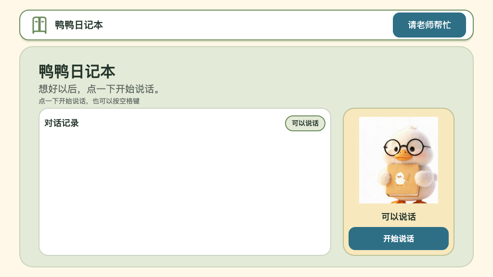
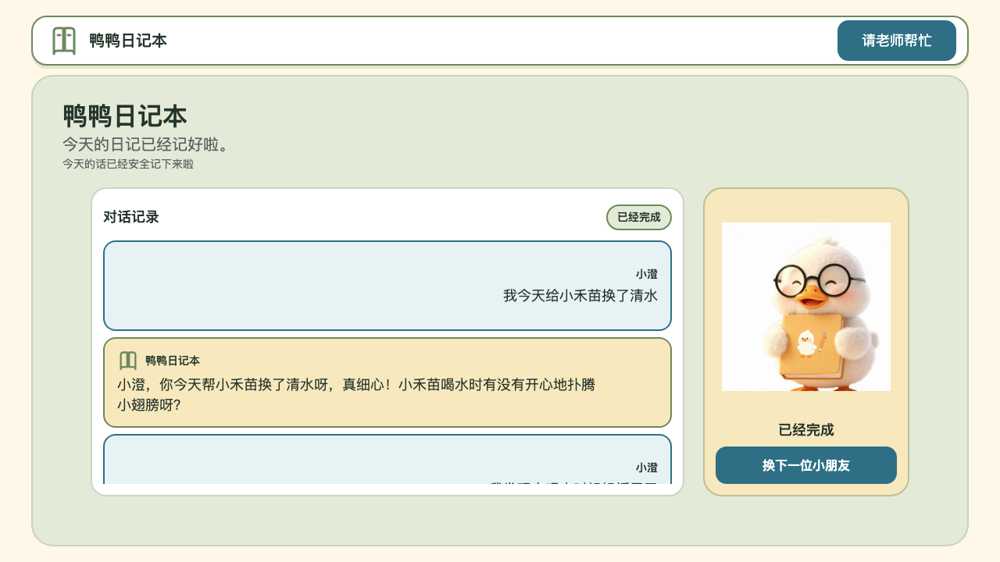
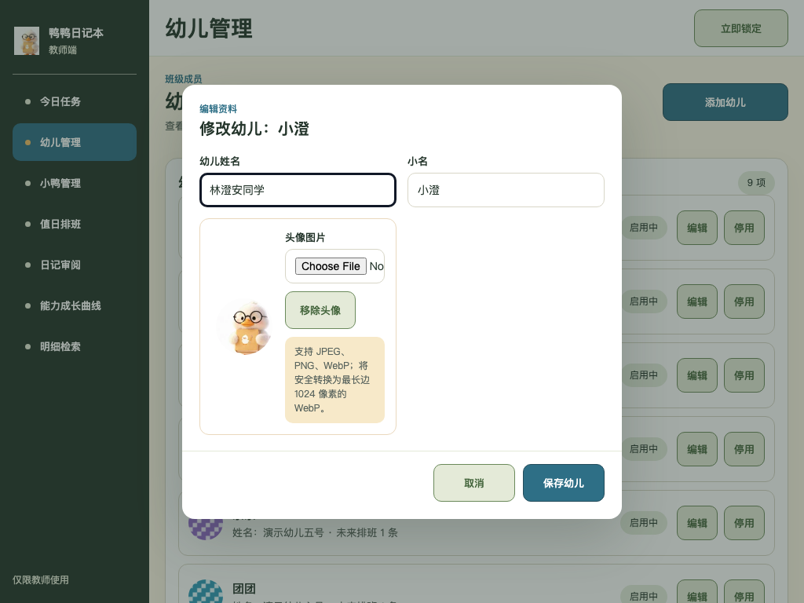
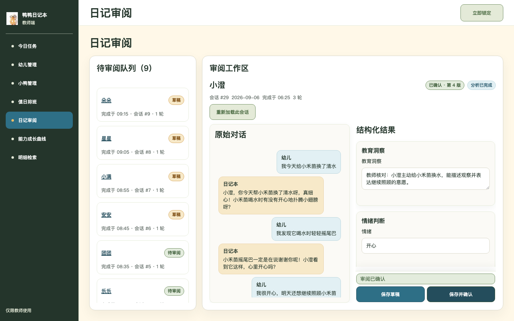
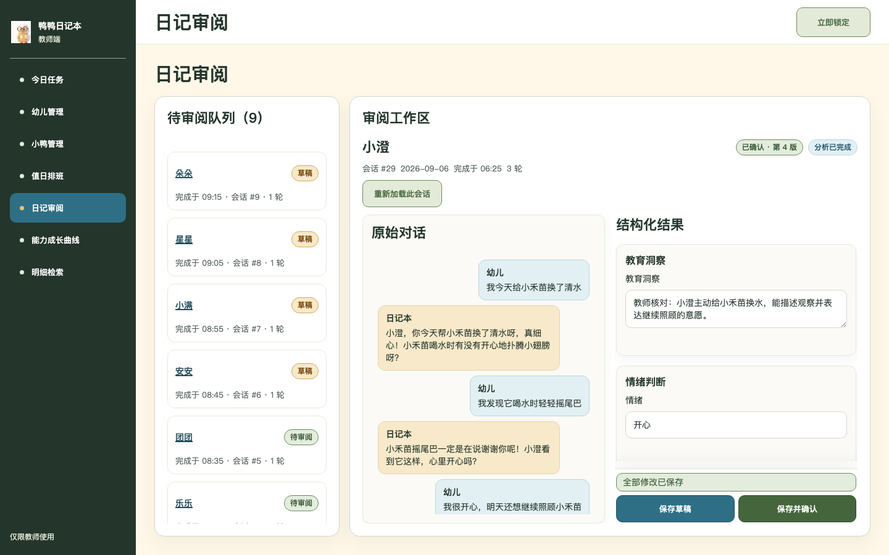
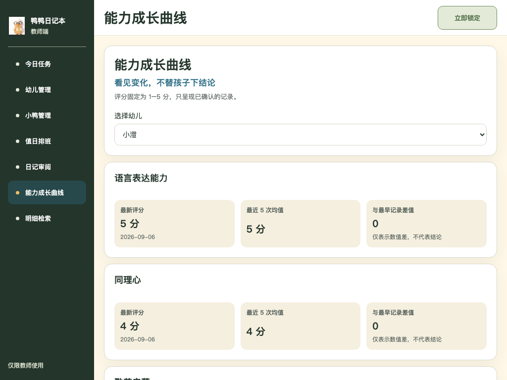

# 鸭鸭日记本使用说明素材

本目录收录经过真实浏览器验收、可直接用于后续产品使用说明书编排的截图。画面中的幼儿、小鸭和业务数据均为合成测试数据，不含教师 PIN、接口密钥、请求头或浏览器私有状态。

## 2026-09-06 真实场景验收

- 验收运行：`20260905T220349410323Z-8ed37c2232ab-f24bfb9ef129`
- 受测源码：`f24bfb9ef1292a0b4c3d728b2177b11e2723229a`
- 结果：`COMPLETE`
- 原始证据：`artifacts/real-uat/20260905T220349410323Z-8ed37c2232ab-f24bfb9ef129/`
- 边界：真实麦克风采集与声学识别仍需人工设备验收；本轮已验证受控语音文本交接、真实 TTS 下载、解码和播放完成。

### 幼儿端

进入会话后的可说话状态。鸭鸭日记本形象常驻，录音入口与对话记录分区清晰。

三轮对话达到轮数上限后的完成状态。对话记录、安全保存提示和“换下一位小朋友”入口均可见。

### 教师端

幼儿资料编辑弹窗，包含姓名、小名和已上传头像。

日记审阅工作区，展示原始会话、结构化结果、分析完成和已确认第 4 版状态。

从明细检索结果进入会话审阅后的目标页面。检索请求、游标分页和深链来源由原始验收证据记录。

小澄的能力成长曲线，展示语言表达能力 5 分、同理心 4 分及已确认记录日期。

## 本轮发现的非阻断体验问题

- 幼儿端较长对话需要在记录面板内滚动，默认完成画面不能一次看完全部记录。
- 进入会话后的首次发言前，主界面未持续显示当前值日幼儿身份。
- 1024 像素宽教师端头像文件选择器仍显示英文原生文案，且提示存在局部截断。
- 综合评分显示为两位小数，但界面尚未解释舍入规则。
